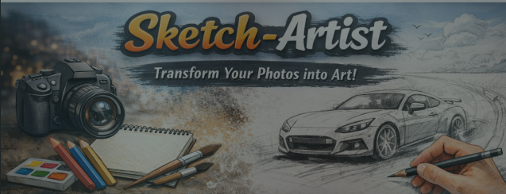

<p align="center">
  
</p>

# 🖌️ Sketch-Artist


---

A simple **Python-based sketch generator** that converts real images into artistic pencil-style sketches using image processing techniques.

This project is ideal for beginners exploring **Computer Vision** and **OpenCV**.

---

## ✨ Features

- Converts images into pencil-sketch style art
- Simple and clean Python implementation
- Beginner-friendly project structure
- Sample image included for testing

---

## 📦 Installation

Clone the repository:

```bash
git clone https://github.com/ArnavPundir22/Sketch-Artist.git
cd Sketch-Artist
```

Install dependencies:

```bash
pip install -r requirement.txt
```

(Optional but recommended)

```bash
python -m venv venv
source venv/bin/activate   # Linux / macOS
venv\Scripts\activate    # Windows
```

---

## ▶️ Usage

Run the sketch generator:

```bash
python artist.py
```

The script processes the default image (`car.jpg`) and generates a sketch output.

You can modify the input image inside `artist.py`.

---

## 📁 Project Structure

```
Sketch-Artist/
├── artist.py          # Main script
├── car.jpg            # Sample input image
├── requirement.txt    # Dependencies
└── .gitignore
```

---

## 🧠 How It Works

1. Reads the input image
2. Converts it to grayscale
3. Applies image processing techniques
4. Produces a pencil-sketch effect

---

## 🚀 Future Improvements

- Add GUI interface
- Support batch image processing
- Multiple sketch styles
- Save output automatically
- Color sketch support

---

## 👨‍💻 Developed By

**Arnav Pundir**  
🎓 Student | 🤖 AI & Computer Vision Enthusiast  

🔗 GitHub: https://github.com/ArnavPundir22

---

⭐ If you like this project, don’t forget to **star the repository**!
